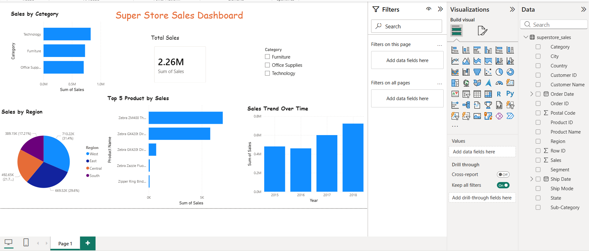

# 📊 Superstore Sales Dashboard

## 🚀 Project Overview
This project analyzes retail sales data using SQL and Power BI to generate business insights and interactive dashboards.

## 📌 Key Insights
- Total Sales: 2.26M
- Technology is the top-performing category
- West region generates highest revenue
- Sales show growth trend over years

## 🛠️ Tools Used
- MySQL
- SQL
- Power BI

## 📊 Dashboard Preview


# 📊 Superstore Sales Analysis (SQL)

## 🔹 1. Total Sales (Overall Business)

**SQL Query:**

```sql
SELECT SUM(Sales) AS total_sales 
FROM superstore_sales;
```

**Insight:**
Total revenue generated by the company.

---

## 🔹 2. Sales by Category

**SQL Query:**

```sql
SELECT Category, SUM(Sales) AS total_sales
FROM superstore_sales
GROUP BY Category
ORDER BY total_sales DESC;
```

**Insight:**
Identifies which category (Furniture, Technology, Office Supplies) generates the most revenue.

---

## 🔹 3. Top 5 Selling Products

**SQL Query:**

```sql
SELECT `Product Name`, SUM(Sales) AS total_sales
FROM superstore_sales
GROUP BY `Product Name`
ORDER BY total_sales DESC
LIMIT 5;
```

**Insight:**
Highlights the best-performing products in terms of sales.

---

## 🔹 4. Sales by Region

**SQL Query:**

```sql
SELECT Region, SUM(Sales) AS total_sales
FROM superstore_sales
GROUP BY Region
ORDER BY total_sales DESC;
```

**Insight:**
Shows which region contributes the highest revenue.

---

## 🔹 5. Sales by State (Top 10)

**SQL Query:**

```sql
SELECT State, SUM(Sales) AS total_sales
FROM superstore_sales
GROUP BY State
ORDER BY total_sales DESC
LIMIT 10;
```

**Insight:**
Identifies top-performing states by sales.

---

## 🔹 6. Top Customers

**SQL Query:**

```sql
SELECT `Customer Name`, SUM(Sales) AS total_sales
FROM superstore_sales
GROUP BY `Customer Name`
ORDER BY total_sales DESC
LIMIT 5;
```

**Insight:**
Finds customers who contribute the most to revenue.

---

## 🔹 7. Sales by Segment

**SQL Query:**

```sql
SELECT Segment, SUM(Sales) AS total_sales
FROM superstore_sales
GROUP BY Segment;
```

**Insight:**
Shows contribution of different customer segments (Consumer, Corporate, Home Office).

---

## 🔹 8. Sales by Sub-Category

**SQL Query:**

```sql
SELECT `Sub-Category`, SUM(Sales) AS total_sales
FROM superstore_sales
GROUP BY `Sub-Category`
ORDER BY total_sales DESC;
```

**Insight:**
Provides deeper analysis of product performance within each category.

---

## 📌 Summary

* Total sales provide overall business performance.
* Category and sub-category analysis identify key revenue drivers.
* Regional and state analysis highlight geographic performance.
* Customer and segment analysis help understand buying behavior.

-------------------------------------------------------------------------------------------------------------------------------------------------------------------------

# 📊 Power BI Dashboard – Superstore Sales

## 🎯 Dashboard Overview

This dashboard provides a comprehensive analysis of retail sales data using Power BI. It highlights key performance indicators, category and regional performance, sales trends, and top-performing products with interactive filtering.

---

## 📌 Key Visualizations

### 💰 1. KPI – Total Sales

**Steps:**

* Click **Card (123 icon)**
* Drag:

  * Sales → Values

**Result:**
Displays total revenue (~2.26M)

**Insight:**
Provides a quick overview of overall business performance.

---

### 📊 2. Sales by Category

**Steps:**

* Click **Clustered Bar Chart**
* Drag:

  * Category → Axis
  * Sales → Values

**Format:**

* Title → *Sales by Category*

**Insight:**
Shows which category (Technology, Furniture, Office Supplies) generates the most revenue.

---

### 🥧 3. Sales by Region

**Steps:**

* Click **Pie Chart**
* Drag:

  * Region → Legend
  * Sales → Values

**Format:**

* Title → *Sales by Region*

**Insight:**
Displays geographic distribution of sales.

---

### 📈 4. Sales Trend Over Time

**Steps:**

* Click **Line Chart**
* Drag:

  * Order Date → Axis
  * Sales → Values

**Important:**

* Select **Date Hierarchy → Month** if needed

**Format:**

* Title → *Sales Trend Over Time*

**Insight:**
Analyzes sales growth and seasonal patterns.

---

### 🏆 5. Top 5 Products by Sales

**Steps:**

* Click **Bar Chart**
* Drag:

  * Product Name → Axis
  * Sales → Values

**Apply Filter:**

* Go to Filters panel
* Select Product Name
* Change filter type → *Top N*
* Set:

  * Top → 5
  * By Value → Sales
* Click **Apply Filter**

**Format:**

* Title → *Top 5 Products by Sales*

**Insight:**
Identifies key products contributing the most revenue.

---

### 🎛️ 6. Slicer (Interactive Filter)

**Steps:**

* Click **Slicer**
* Drag:

  * Category

**Usage:**
Allows filtering the entire dashboard by category (Furniture, Technology, etc.)

---

## 🎨 Dashboard Design

**Layout Structure:**

* Total Sales KPI (Top)
* Category & Region Charts (Side by Side)
* Sales Trend (Full Width)
* Top 5 Products (Bottom)
* Slicer (Side or Bottom)

**Enhancements:**

* Enable titles for all visuals
* Increase font size
* Add main title:

  * *Superstore Sales Dashboard*

---

## 🧠 Project Explanation

“I built an interactive Power BI dashboard using retail sales data. It includes KPIs, category-wise and region-wise analysis, time-based trends, and top-performing products with dynamic filtering.”

---

## 🏆 Project Strengths

* Real-world dataset
* Combined SQL + Power BI analysis
* Business-driven insights
* Interactive dashboard design

---

## 🚀 Bonus Enhancements

* Sales by Segment
* Map visualization (State-wise sales)
* Profit/Loss analysis (if dataset includes profit)


# Superstore Sales Dashboard

## Project Overview
This project analyzes retail sales data using SQL and Power BI.

## Tools Used
- MySQL (Data Analysis)
- Power BI (Visualization)

## Key Insights
- Total sales: 2.26M
- Technology category generated highest revenue
- West region contributed maximum sales
- Top 5 products identified

## Files Included
- dataset: Raw CSV data
- sql: Analysis queries
- powerbi: Dashboard file
- screenshots: Dashboard preview

-------------------------------------------------------------------------------------------------------------------------------------------------------------------

## 🛠️ Tools and Technologies Used

* **MySQL Workbench**
  Used for data import, database creation, and performing SQL queries for data analysis.

* **SQL (Structured Query Language)**
  Used for data aggregation, filtering, and extracting insights such as total sales, category-wise analysis, and top-performing products.

* **Microsoft Power BI**
  Used for data visualization and building an interactive dashboard with charts, KPIs, and slicers.

* **Microsoft Excel / CSV Dataset**
  Used as the source of raw data (Superstore Sales dataset).

* **Windows Snipping Tool / Screenshot Tool**
  Used to capture query outputs and dashboard visuals for documentation.

* **File System (Local Project Structure)**
  Organized files into folders such as dataset, SQL scripts, Power BI dashboard, and screenshots for better project management.
